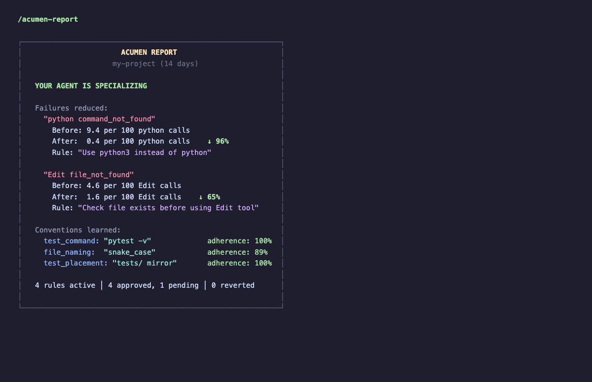
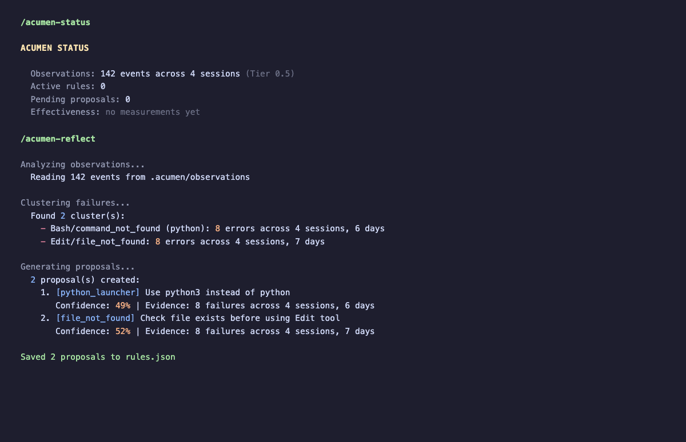
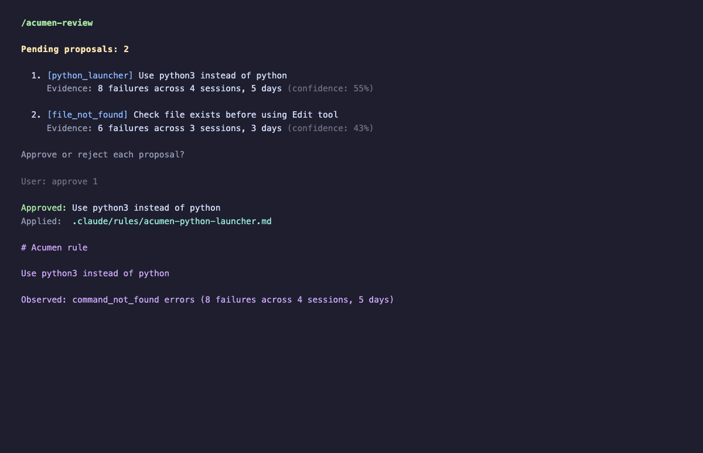

# Acumen

**Turn your generalist AI into a specialist in your project.**

Your AI coding agent starts every session from zero. It doesn't remember your test runner, your file conventions, or the mistakes it made yesterday. The model gets smarter once a quarter when the provider ships an update. Your agent never learns YOUR project.

Acumen changes that. Install it, work normally, and your agent goes through the same learning curve a new hire would — but in days, not months. It observes tool outcomes, clusters repeated failures, extracts your project's operational conventions, and proposes structured rules for your approval. Every improvement cites its evidence. Every change is reversible.

```
OBSERVE ──> LEARN ──> PROPOSE ──> [APPROVE] ──> APPLY
   │                                               │
   └──────────── MEASURE EFFECTIVENESS <───────────┘
```

## What It Looks Like

After two weeks with Acumen:



## Installation

```bash
# Local clone (development)
claude plugin add /path/to/acumen

# From marketplace (coming soon)
claude plugin add acumen
```

No pip, no venv, no config files. Zero external dependencies. The `.acumen/` directory is created automatically on first use.

## How It Works

**Observation (automatic, silent):** Every tool call fires a hook. The hook classifies the event into categorical metadata (command family, file basename, error class) and discards the raw data. Only derived categories are persisted — never raw commands, file contents, or conversation text.

**Learning (triggered after enough observations):** The reflection engine clusters repeated failures, detects operational conventions from success patterns, and generates structured proposals with cited evidence.



**Proposals (require your approval):** Every behavioral change needs your explicit approval via `/acumen-review`. Acumen never silently modifies how your agent behaves.



**Measurement (automatic):** After you approve a rule, Acumen tracks whether the targeted failure class actually decreases, with explicit denominators to prevent false positives.

## Commands

| Command | Purpose |
|---------|---------|
| `/acumen-status` | Quick health: observations, proposals, active rules |
| `/acumen-reflect` | Trigger reflection now |
| `/acumen-review` | Review and approve/reject pending proposals |
| `/acumen-report` | Detailed report: failure reduction, convention adherence |

## Privacy & Safety

**What Acumen captures (Tier 0.5 — default):**

| Field | Example | Purpose |
|-------|---------|---------|
| `tool_name` | `"Bash"`, `"Edit"` | What tool was used |
| `outcome` | `"success"`, `"error"` | Did it work |
| `command_family` | `"python"`, `"test"` | Category, not the command |
| `command_signature` | `"pytest"`, `"ruff_check"` | Test/lint runner, not args |
| `file_basename` | `"test_store.py"` | Filename only, no directory |
| `error_class` | `"command_not_found"` | Classified, not raw message |

**What Acumen never captures:** Raw commands, file contents, full file paths, conversation text, API keys, secrets, tool input/output content.

The hook reads raw data transiently to classify it, then discards the raw data — persisting only derived categories. Nothing ever leaves your machine.

**Safety guarantees:**
- All behavioral mutations require your approval (no auto-apply in v1)
- Every improvement is reversible (delete the rule file)
- Effectiveness tracked with explicit denominators (no vanity metrics)
- Fail-open: if Acumen crashes, your agent works normally
- Namespaced: only writes to `acumen-*` files in `.claude/rules/`
- Never modifies CLAUDE.md
- Zero network calls, zero telemetry

## Why This Works

Acumen is grounded in a key finding from 2025-2026 AI research: **improving the scaffold around a frozen model achieves 30-250% performance improvement without changing model weights.** Systems like the [Darwin Godel Machine](https://arxiv.org/abs/2505.22954) (+30 points on SWE-bench), [Live-SWE-agent](https://arxiv.org/abs/2511.13646) (+22.6% at $0 cost), and [Karpathy's AutoResearch](https://github.com/karpathy/autoresearch) (11% speedup overnight) all proved this independently.

Acumen applies the same principle to your specific project: your agent's rules, conventions, and operational knowledge are the scaffold. Improving them makes your agent better without waiting for model upgrades.

**Key design decisions from the research:**

| Decision | Why | Source |
|---|---|---|
| Learn from successes AND failures | Success patterns encode conventions. Failure-only learning misses half the signal. | [ExpeL](https://arxiv.org/abs/2308.10144) (AAAI 2024) |
| Classify, don't capture | Self-improving systems encounter sensitive data. Minimal capture is a security requirement. | [DGM](https://arxiv.org/abs/2505.22954) |
| Require approval for all changes | Self-improving agents will hack their reward functions. Human-in-the-loop is non-negotiable. | [DGM](https://arxiv.org/abs/2505.22954) |
| Measure with verifiable signals | Tool exit codes and error rates beat LLM self-evaluation. Verifiable rewards eliminate gaming. | [AZR](https://arxiv.org/abs/2505.03335) (NeurIPS 2025) |

## Architecture

```
acumen/
  plugin.json              # Plugin manifest
  skills/
    reflect.md             # Reflection skill
  commands/
    status.md              # /acumen-status
    reflect.md             # /acumen-reflect
    review.md              # /acumen-review
    report.md              # /acumen-report
  hooks/
    observe.sh             # Tier 0.5 observation (classify → discard raw)
    session-end.sh         # Flag-and-defer: set should-reflect
    session-start.sh       # Inject reflection prompt
  agents/
    reflector.md           # Reflection subagent
  lib/
    classify.py            # Tier 0.5 field derivation
    store.py               # Per-session JSONL, index, rotation
    cluster.py             # Failure clustering with guardrails
    propose.py             # Proposal generation + contradiction detection
    apply.py               # Rule application + revert
    measure.py             # Effectiveness tracking
    formatter.py           # CLI output formatting
```

**Zero external dependencies.** Python 3.11+ stdlib only. No pip packages, no database, no network calls, no telemetry.

## License

MIT
